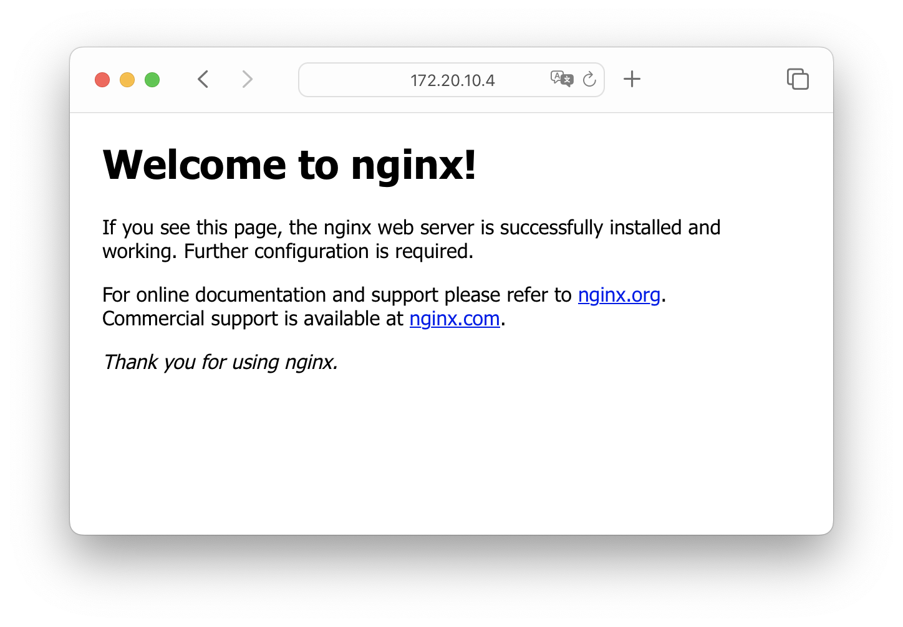
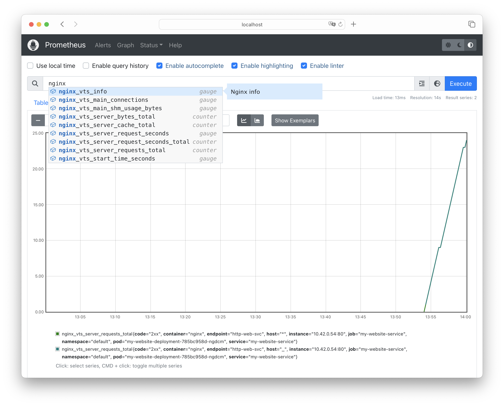

# Observability Workshop Manifests

Welcome to the Observability Workshop repository! Here you will find a collection of manifest files used during our workshop on the 20th of June. These manifests are designed to help you explore observability in Kubernetes, add metrics to your applications, and experience automatic scaling using the Horizontal Pod Autoscaler (HPA).

## Prerequisites
To make the most of this workshop, ensure that you have the following prerequisites in place:
- Access to a local Kubernetes cluster hosted by Rancher Desktop
- Basic knowledge of containers and Kubernetes concepts

## Manifest Files
This repository contains the following manifest files:

1. `nginx.yaml`: Deploy this manifest to set up a sample deployment, service, and ingress object. We will scrape metrics from this nginx deployment as part of the workshop.

2. `prometheus-operator.yaml`: Use this manifest to deploy the Prometheus Operator and its custom resource definition (CRD). The Prometheus Operator simplifies the management of Prometheus instances in Kubernetes.

3. `prometheus.yaml`: Deploy this manifest to create a Prometheus server. Prometheus is a popular monitoring and alerting toolkit that collects metrics from various sources.

4. `servicemonitor.yaml`: Use this manifest to configure a ServiceMonitor object that instructs Prometheus on how to scrape metrics from our sample nginx deployment.

5. `k6-loadtest-job.yaml`: This manifest file deploys a Kubernetes job that runs a load test on the my-website deployment. The job utilizes k6, a popular open-source load testing tool, to simulate concurrent users and measure the performance of your application under different scenarios.

6. `test.js`: This file contains the k6 load test code. You can customize and modify this file to define your specific load testing scenarios and assertions.

7. `hpa.yaml`: This manifest file contains a Horizontal Pod Autoscaler (HPA) configuration. It enables automatic scaling of the sample deployment based on CPU usage.

8. `prometheus-adapter.yaml`: This manifest file sets up a Prometheus Adapter, which allows Kubernetes to use metrics from Prometheus for the Horizontal Pod Autoscaler (HPA) to perform scaling based on custom metrics.

9. `hpa-custom.yaml`: This manifest file creates a custom Horizontal Pod Autoscaler (HPA) based on metrics scraped by Prometheus. It enables scaling based on custom metrics.

Feel free to explore, modify, and experiment with these manifest files during the workshop. We encourage you to dive into the configurations and adapt them to your specific use cases.

## Getting Started
To get started with the workshop, follow these steps:

1. Clone this repository to your local machine:
   ```
   git clone https://github.com/guusbeckett/devdays2023.git
   ```

2. Navigate to the cloned repository:
   ```
   cd devdays2023
   ```

3. Deploy the manifest files using the `kubectl create` command:
   ```
   kubectl create -f nginx.yaml
   kubectl create -f prometheus-operator.yaml
   kubectl create -f prometheus.yaml
   kubectl create -f servicemonitor.yaml
   ```

4. Visit the website you've just deployed. Use the `kubectl get services -A` to list all services in your cluster. The only public IP address will be the IP address for your ingress controller. You can paste this IP address in your browser to access the default Nginx hello world page.
   ```
   kubectl get services -A
   ```
The page should look like this:



5. To look at the Prometheus dashboard, you can set up a port forward to the `prometheus-containerized` service using the Rancher Desktop interface. Go to "Port Forwarding" and use the `Forward` button right next to the `prometheus-containerized` service. copy the port number and confirm the port forwarding. After you've done this you can visit `http://localhost:<port>` to access the Prometheus instance. 



## K6 loadtest
To execute the load test using k6 in this Kubernetes environment, follow the steps below:

1. Execute the following command to create a ConfigMap named `test-file` using the `test.js` file from the `k6` folder:
   ```
   kubectl create configmap test-file --from-file=k6/test.js
   ```

   This command creates a ConfigMap in Kubernetes called `test-file` that allows you to provide the `test.js` file to the load testing job.

2. Execute the following command to create the load testing job in Kubernetes:
   ```
   kubectl create -f k6/k6-loadtest-job.yaml
   ```

   This command deploys the load testing job, which runs the k6 load test using the `test.js` file provided through the ConfigMap.

3. Monitor the status and progress of the load testing job using `kubectl` commands, such as:
   ```
   kubectl get jobs
   kubectl describe job <job-name>
   kubectl logs -f <pod-name>
   ```

   These commands allow you to observe the job's status, details, and real-time logs during the load test execution.

By following these steps, you will be able to initiate the load testing process using k6 in Kubernetes and gain valuable insights into your application's performance under various scenarios.

Happy load testing, and may your applications withstand the heaviest of workloads with ease!

## Scaling based on metrics

To observe the automatic scaling behavior of the deployment based on CPU load, follow the steps below:

1. Execute the following command to create the Horizontal Pod Autoscaler (HPA) configuration:
   ```
   kubectl create -f hpa.yaml
   ```

   This command deploys the HPA based on CPU usage to automatically scale the deployment.

2. Now, rerun the load test to observe the deployment scaling based on CPU load. Use the previous method you followed to execute the load test.

3. Monitor the deployment and observe how it automatically scales based on the CPU load. You should see the number of replica pods increasing or decreasing as needed to meet the desired CPU utilization threshold.

4. To remove the HPA and stop the automatic scaling, execute the following command:
   ```
   kubectl delete -f hpa.yaml
   ```

   This command deletes the HPA, and the deployment will no longer scale automatically based on CPU load.

To explore custom metrics for scaling, follow these additional steps:

1. Deploy the Prometheus Adapter by executing the following command:
   ```
   kubectl create -f prometheus-adapter.yaml
   ```

   This command deploys the Prometheus Adapter, enabling Kubernetes to use metrics from Prometheus for scaling purposes.

2. Deploy the custom HPA based on custom metrics by running the following command:
   ```
   kubectl create -f hpa-custom.yaml
   ```

   This command creates the custom HPA configuration that scales the deployment based on the custom metric defined in the Prometheus configuration.

3. Rerun the load test to observe the deployment scaling based on the custom metric. Use the previous method to execute the load test.

4. Monitor the deployment and observe how it scales automatically based on the custom metric. You should see the number of replica pods increasing or decreasing based on the custom metric's values.


Enjoy exploring the dynamic scaling capabilities provided by Kubernetes and Prometheus!


## Additional Resources
For additional resources and references related to observability in Kubernetes, check out the following links:

- [Kubernetes Documentation](https://kubernetes.io/docs/home/): Official documentation for Kubernetes.
- [Prometheus Documentation](https://prometheus.io/docs/): Official documentation for Prometheus, a popular monitoring and alerting toolkit.
- [Horizontal Pod Autoscaler (HPA) Documentation](https://kubernetes.io/docs/tasks/run-application/horizontal-pod-autoscale/): Learn more about the Horizontal Pod Autoscaler and how to configure it for your applications.

## Workshop Details
- Date: 20th June
- Location: Breda
- Workshop Duration: 3 hours + lunch break

Please ensure that you have the necessary prerequisites ready before attending the workshop. We look forward to exploring the exciting world of observability in Kubernetes with you!

If you have any questions or need assistance, feel free to reach out to our workshop instructors. Happy exploring and enjoy the workshop!
